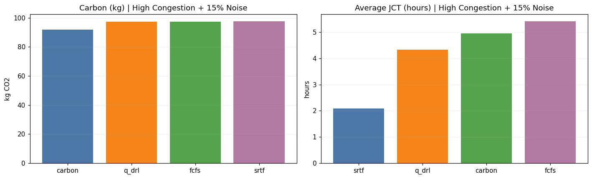
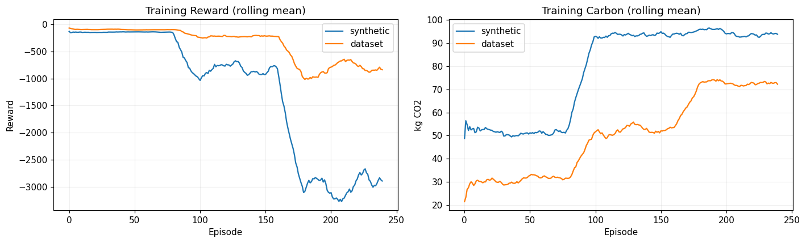
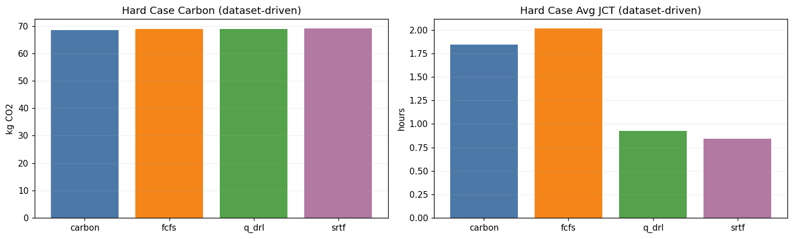
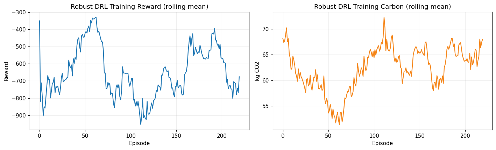
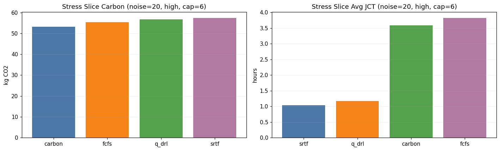
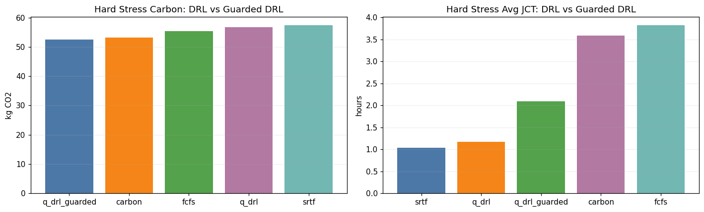
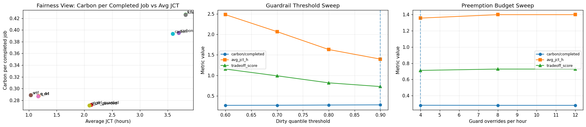
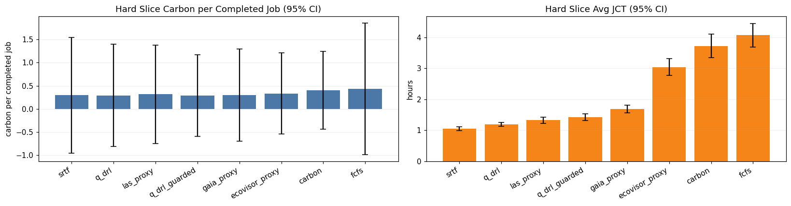
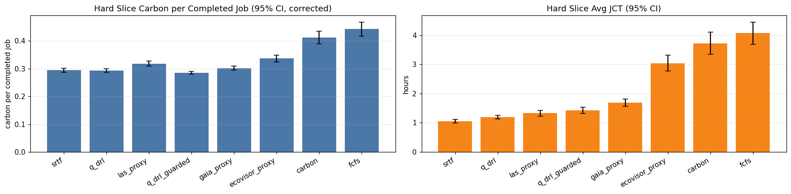

# Initial DRL Experiments Notebook Documentation

Project: Eco-Cloud  
Notebook: notebooks/initial_drl_experiments.ipynb  
Documentation version: 1.0  
Date: 2026-04-07

---

## 1. Purpose and Scope

This document provides a full technical specification and interpretation guide for the notebook-based experimentation workflow implemented in `notebooks/initial_drl_experiments.ipynb`.

It is written to support:
1. Internal reproducibility and method traceability.
2. Paper writing (methods, experiments, and results sections).
3. Future migration from notebook prototypes into modular code under `src/ml_engine/` and `src/integration/`.

The notebook started as a Phase 4 prototype and evolved into a Phase 4-6 style evidence pipeline with:
1. Baseline scheduling comparisons.
2. DRL training and stress testing.
3. Guardrail and budget policy controls.
4. Fairness-normalized reporting.
5. Baseline parity proxies.
6. 30-seed confidence and significance analysis.

---

## 2. High-Level Research Question

Core question:

Can a compact DRL scheduler reduce carbon impact while maintaining acceptable job completion performance under realistic stress conditions, and how does it compare against conventional and proxy baselines?

Secondary question:

When DRL is augmented with carbon guardrails, what is the empirical carbon-latency tradeoff and where is the best operating point?

---

## 3. Notebook Architecture Overview

The notebook is structured into sequential blocks.

### Block A: Core simulation and tabular DRL baseline
1. Defines job/workload classes and carbon curve generation.
2. Implements `SimpleClusterEnv` with queue and running sets.
3. Implements fixed policies (FCFS, carbon-aware heuristic, SRTF).
4. Implements tabular Q-learning and baseline evaluation.

### Block B: Dataset-driven upgrades
1. Loads `clean_dataset.csv`.
2. Maps real columns into simulator-compatible workload features.
3. Adds curriculum training and reward-weight sweep.
4. Evaluates robustness across congestion and noise settings.

### Block C: Real-world stress and guarded DRL
1. Adds carbon spikes/dips and workload shocks.
2. Adds domain-randomized DRL training.
3. Adds guarded DRL (dirty-grid override policy).
4. Adds fairness-normalized and tradeoff metrics.

### Block D: Guardrail and budget sweeps
1. Threshold sweep over dirty quantiles.
2. Budgeted guard override experiments.
3. Summary plots and export artifacts.

### Block E: Baseline parity and 30-seed report
1. Adds proxy baselines (LAS-like, EcoVisor-like, GAIA-like).
2. Runs 30-seed parity stress matrix.
3. Produces CI summaries and hard-slice ranking.

### Block F: Results-freeze corrections
1. Recomputes metric-specific CI for carbon-per-completed-job.
2. Replots corrected CI chart.
3. Runs bootstrap pairwise significance tests.

---

## 4. Environment Model and Scheduling Formulation

### 4.1 Time and capacity
1. Time step: 5 minutes.
2. Horizon: 288 steps (24 hours).
3. Default cluster capacity: 8 slots (stress experiments also use 6 and 10).

### 4.2 Job representation
Each job has:
1. `job_id`
2. `submit_step`
3. `duration_steps`
4. `power_kw`

### 4.3 Carbon model
Base curve is sinusoidal over 24 hours with additive Gaussian forecast noise, clipped to [80, 650].

Stress variant introduces:
1. Dirty-grid spikes.
2. Clean-grid dips.
3. Additional noise variability.

### 4.4 State representation for DRL
State vector:
1. `ci_norm`: normalized carbon intensity.
2. `load`: normalized queue load proxy.
3. `util`: current utilization.

Tabular discretization:
1. Carbon bin: 3 bins.
2. Load bin: 3 bins.
3. Utilization bin: 2 bins.

Q-table shape:
`(3, 3, 2, 3)` corresponding to state bins and 3 actions.

### 4.5 Action space
Discrete action index mapped to priority policy:
1. 0 -> FCFS
2. 1 -> carbon heuristic
3. 2 -> SRTF

Interpretation: the DRL agent is a policy selector over interpretable dispatch styles at each step.

### 4.6 Reward definition
Step cost is a weighted sum of:
1. Carbon penalty (`step_carbon_kg`)
2. JCT proxy penalty (`len(waiting) + 0.25 * len(running)`)
3. Preemption penalty (`preemptions`)

Default weights:
1. carbon: 0.5
2. jct: 0.4
3. preempt: 0.1

Reward is negative total cost:

`reward = -(w_c * carbon_penalty + w_j * jct_penalty + w_p * preempt_penalty)`

---

## 5. Training and Evaluation Protocol

### 5.1 Early baseline training
Tabular Q-learning with epsilon decay is first trained on moderate synthetic scenarios.

### 5.2 Curriculum training
Stage progression:
1. light / 0% noise
2. moderate / 5% noise
3. high / 15% noise

This stabilizes learning before hard stress evaluation.

### 5.3 Domain-randomized robust training
Per episode randomization includes:
1. Source mix (dataset-driven and synthetic).
2. Congestion regime.
3. Noise level.
4. Capacity regime.
5. Workload shocks and carbon volatility.

### 5.4 Stress evaluation grid
Used repeatedly across sections:
1. Noise: 0.0, 15.0, 20.0
2. Congestion: moderate, high
3. Capacity: 6, 8
4. Multi-seed aggregation (20 or 30 depending on section)

---

## 6. Dataset Integration Details

Source file: `clean_dataset.csv`

Required columns:
1. `start_time`
2. `duration`
3. `energy`
4. `plan_cpu`
5. `job_name`
6. `task_name`

Transform pipeline:
1. Drop rows with missing required numeric fields.
2. Clip `duration` and `energy` to non-degenerate minimum values.
3. Compute `power_proxy = energy / duration`.
4. Map `start_time` to simulation submit steps in [0, horizon).
5. Convert raw duration into step units and clip for stability.
6. Quantile-map `power_proxy` to simulator bands {1.2, 2.0, 3.2} kW.

Rationale:
This keeps simulator complexity manageable while preserving relative workload and power heterogeneity from real traces.

---

## 7. Policy Set and Baseline Definitions

### 7.1 Fixed baselines
1. FCFS
2. Carbon heuristic
3. SRTF

### 7.2 Learned policies
1. `q_drl`: tabular DRL policy selector.
2. `q_drl_guarded`: DRL with carbon-threshold override.

### 7.3 Parity proxy baselines
Implemented for stronger comparative context:
1. `las_proxy`: Tiresias-like least attained service first.
2. `ecovisor_proxy`: carbon-aware score with anti-starvation aging term.
3. `gaia_proxy`: short-horizon carbon trend look-ahead scheduler.

Note:
These are practical proxies built for controlled parity comparisons, not exact replicas of external systems.

---

## 8. Guardrail and Budget Mechanisms

### 8.1 Guardrail threshold
Guarded DRL overrides DRL action with carbon heuristic action when current CI exceeds a chosen quantile threshold.

Quantile sweep tested:
1. 0.60
2. 0.70
3. 0.80
4. 0.90

### 8.2 Override budget
Adds per-hour cap on number of guard overrides.

Budget sweep tested:
1. 4/hour
2. 8/hour
3. 12/hour

Interpretation goal:
Find a practical operating point that limits policy thrashing while preserving carbon intent.

---

## 9. Metrics and Reporting Conventions

Primary metrics:
1. `carbon_kg`
2. `avg_jct_h`
3. `tail_jct_h`
4. `preemptions`
5. `jobs_completed`

Derived metrics:
1. `carbon_per_completed_job = carbon_kg / jobs_completed`
2. `tradeoff_score = 0.6 * carbon_per_completed_job + 0.4 * avg_jct_h`

Statistical outputs:
1. Mean
2. Standard deviation
3. 95% CI (normal approximation over seed means)

Significance outputs:
1. Bootstrap mean-difference CI (5000 resamples)
2. Two-sided bootstrap p-value
3. Significant-at-95 flag

---

## 10. Exported Artifacts and Their Roles

### Core and intermediate outputs
1. `data/initial_drl_experiment_results.csv`: early baseline summary.
2. `data/improved_drl_summary_dataset.csv`: improved dataset-driven summary.
3. `data/reward_sweep_dataset.csv`: reward weight sweep outcomes.

### Stress and safety outputs
1. `data/realworld_stress_summary.csv`: stress evaluation summary.
2. `data/realworld_stress_plus_guarded_summary.csv`: stress summary including guarded DRL.

### Fairness and control outputs
1. `data/fairness_normalized_summary.csv`
2. `data/guardrail_quantile_sweep.csv`
3. `data/preemption_budget_sweep.csv`

### Parity and inference outputs
1. `data/parity_30seed_detail.csv`: full per-seed parity detail table.
2. `data/parity_30seed_ci_summary.csv`: initial 30-seed CI summary.
3. `data/parity_30seed_hard_slice_ranking.csv`: hardest-slice ranking.
4. `data/parity_30seed_ci_metric_corrected.csv`: corrected metric-specific CI table.
5. `data/parity_30seed_hard_slice_ci_metric_corrected.csv`: corrected hard-slice CI table.
6. `data/parity_30seed_hard_slice_significance.csv`: bootstrap significance report.

Paper-writing recommendation:
Use corrected CI and significance files as canonical evidence for claims.

---

## 11. Main Empirical Findings (Current Notebook State)

Hard slice referenced below:
1. noise = 20.0
2. congestion = high
3. capacity = 6
4. seeds = 30

### 11.1 Ranking by tradeoff score (lower is better)
From corrected hard-slice CI output:
1. `srtf` ~ 0.597
2. `q_drl` ~ 0.650
3. `las_proxy` ~ 0.720
4. `q_drl_guarded` ~ 0.740
5. `gaia_proxy` ~ 0.856
6. `ecovisor_proxy` ~ 1.418
7. `carbon` ~ 1.735
8. `fcfs` ~ 1.891

### 11.2 Carbon-per-completed-job leaders
1. `q_drl_guarded` best carbon efficiency.
2. `q_drl` and `srtf` are close behind.
3. `carbon` and `fcfs` are substantially worse in this hard slice.

### 11.3 Latency leaders
1. `srtf` best avg JCT.
2. `q_drl` second.
3. `q_drl_guarded` slower than plain `q_drl` due to conservative overrides.

### 11.4 Significance highlights (bootstrap)
Comparisons of `q_drl` against major baselines show:
1. Strong significant improvements vs `carbon` and `fcfs` for both carbon-per-completed-job and avg JCT.
2. Vs `srtf`: avg JCT is significantly worse for `q_drl`, but carbon-per-completed-job difference is not significant.
3. Vs `q_drl_guarded`: guarded variant has significantly better carbon-per-completed-job but significantly worse avg JCT.

Interpretation:
1. `q_drl` is a strong balanced default.
2. `q_drl_guarded` is a carbon-first mode.
3. `srtf` remains speed-first leader.

---

## 12. How to Translate This into Paper Claims

### Claim category A: Baseline dominance
Supported claim style:
1. DRL significantly outperforms FCFS and carbon heuristic under high-noise stress in both carbon efficiency and latency.

Evidence source:
1. `parity_30seed_hard_slice_significance.csv`
2. `parity_30seed_hard_slice_ci_metric_corrected.csv`

### Claim category B: Frontier characterization
Supported claim style:
1. The principal frontier is between SRTF (latency-optimal) and DRL variants (carbon-aware balance).

Evidence source:
1. corrected hard-slice CI plots.
2. non-significant carbon difference between `q_drl` and `srtf` plus significant JCT difference.

### Claim category C: Safety-policy effect
Supported claim style:
1. Guardrails improve carbon-per-completed-job but incur measurable latency cost.

Evidence source:
1. bootstrap significance between `q_drl` and `q_drl_guarded`.

---

## 13. Reproducibility and Execution Checklist

Before running parity and freeze blocks:
1. Execute cells in order from top of notebook.
2. Ensure `clean_dataset.csv` is reachable from notebook relative path.
3. Ensure data output directory exists or can be created.

Critical checks:
1. Verify `parity_30seed_detail.csv` is generated before corrected CI/significance cells.
2. Use corrected CI files (metric-corrected) for final figures.
3. Keep random seeds fixed for exact reruns.

---

## 14. Known Limitations and Practical Notes

1. DRL agent is tabular and uses coarse discretization; this constrains representational capacity.
2. Proxy baselines are approximation-based, not full external system replications.
3. Tradeoff score depends on weighting (0.6 carbon efficiency, 0.4 latency); different weights can reorder policies.
4. Bootstrap significance is robust for current comparisons but still scenario-specific.

Implication for next phase:
1. Preserve this notebook as a stable benchmark harness.
2. Port comparable logic to modular implementation before algorithmic expansion (for example, PPO).

---

## 15. Recommended Citation Mapping for Paper Sections

Methods section references:
1. Sections 4, 5, 6, 7, 8 of this document.

Experimental setup references:
1. Sections 5 and 9.

Results section references:
1. Sections 10 and 11 plus exported tables.

Discussion section references:
1. Sections 11, 12, and 14.

---

## 16. Quick Reference Table

For fastest lookup during writing:
1. Lowest tradeoff score in hard slice: `srtf`; recommended ML-balanced default: `q_drl`.
2. Best speed policy: `srtf`.
3. Best carbon-efficiency policy: `q_drl_guarded`.
4. Canonical evidence files: corrected CI and hard-slice significance outputs.

---

## 17. Visual Evidence Atlas (Notebook Output Figures)

This section embeds key figures exported directly from notebook outputs. Use these images as references when drafting the paper figures section.

### Figure 17.1: Initial baseline comparison (high congestion + 15% noise)

Interpretation:
1. In the first baseline stage, the carbon heuristic is best on pure carbon while SRTF is best on JCT.
2. Early DRL is not yet globally dominant but sits between carbon-first and speed-first strategies.
3. This validates that the benchmark setting is non-trivial and has a real tradeoff frontier.

### Figure 17.2: Curriculum training behavior (synthetic vs dataset-driven)

Interpretation:
1. Learning trajectories differ strongly by source regime.
2. Dataset-driven trajectories are smoother and less extreme than synthetic trajectories.
3. This supports the decision to keep both sources in the curriculum/randomization pipeline.

### Figure 17.3: Hard-case dataset-driven evaluation

Interpretation:
1. SRTF retains speed advantage in this slice.
2. Carbon-level separation remains modest between top policies.
3. Motivates deeper stress and fairness-normalized analysis beyond raw carbon totals.

### Figure 17.4: Domain-randomized robust DRL training dynamics

Interpretation:
1. Robust training does not converge monotonically, which is expected under randomized stress.
2. Carbon remains bounded in a stable range despite random scenario shifts.
3. Indicates policy robustness, not merely overfitting to one deterministic profile.

### Figure 17.5: Stress-slice baseline comparison

Interpretation:
1. In hard stress conditions, FCFS and carbon heuristic incur severe JCT penalties.
2. SRTF and DRL remain in the low-latency regime.
3. DRL keeps latency competitive while preserving carbon-aware behavior.

### Figure 17.6: Guarded DRL vs plain DRL

Interpretation:
1. Guarded DRL improves carbon side but pushes latency upward.
2. This is a control knob, not a universally superior policy.
3. Supports presenting guarded DRL as a carbon-first deployment mode.

### Figure 17.7: Fairness + threshold + budget dashboard

Interpretation:
1. Fairness scatter reveals two broad regions: low-carbon/low-JCT vs high-carbon/high-JCT policies.
2. Threshold sweep shows lower quantiles reduce carbon-per-completed-job but can degrade JCT sharply.
3. Budget sweep shows diminishing returns beyond small override budgets.

### Figure 17.8: Pre-correction 30-seed hard-slice CI chart

Interpretation:
1. Left panel overstates uncertainty for carbon-per-completed-job due to metric/CI mismatch.
2. Right panel (JCT) remains directionally valid.
3. This figure is retained as process evidence, not final inference evidence.

### Figure 17.9: Corrected hard-slice CI chart (final evidence figure)

Interpretation:
1. Corrected carbon-per-completed-job CIs are tight and realistic.
2. Policy ordering is stable and consistent with significance tables.
3. This is the preferred chart for the paper's main result section.

---

## 18. Deep-Dive Findings by Objective

### 18.1 Carbon-efficiency objective
1. Best carbon-per-completed-job in hard slice: `q_drl_guarded` (0.2845 +/- 0.0054).
2. `q_drl` (0.2928 +/- 0.0062) and `srtf` (0.2941 +/- 0.0071) are close.
3. `carbon` and `fcfs` are substantially worse in carbon-per-completed-job despite lower absolute completion volume.

### 18.2 Latency objective
1. Best avg JCT: `srtf` (1.0524h +/- 0.0544h).
2. `q_drl` is second (1.1855h +/- 0.0621h).
3. `q_drl_guarded` increases latency (1.4244h +/- 0.1046h) due to defensive overrides.

### 18.3 Balanced objective (tradeoff score)
1. Lowest tradeoff score is `srtf` (0.5974 +/- 0.0235).
2. `q_drl` is second (0.6499 +/- 0.0262) and is the strongest ML-centered balanced policy.
3. `q_drl_guarded` is carbon-first, not tradeoff-optimal under current weighting.

### 18.4 Completion-volume behavior
1. `srtf` and `q_drl` keep high completion volume (~198 and ~197 jobs respectively in hard slice).
2. `carbon` and `fcfs` complete far fewer jobs (~133 and ~130).
3. This is why fairness-normalized metrics are essential: lower absolute carbon alone can be misleading.

---

## 19. Quantitative Results Tables (Paper-Ready)

### 19.1 Hard-slice policy summary (30-seed, corrected CI)

| Policy | Carbon per completed job (mean +/- CI95) | Avg JCT (h, mean +/- CI95) | Tradeoff score (mean +/- CI95) | Jobs completed (mean) |
|---|---:|---:|---:|---:|
| srtf | 0.2941 +/- 0.0071 | 1.0524 +/- 0.0544 | 0.5974 +/- 0.0235 | 198.2 |
| q_drl | 0.2928 +/- 0.0062 | 1.1855 +/- 0.0621 | 0.6499 +/- 0.0262 | 197.3 |
| las_proxy | 0.3180 +/- 0.0086 | 1.3236 +/- 0.0966 | 0.7203 +/- 0.0386 | 182.0 |
| q_drl_guarded | 0.2845 +/- 0.0054 | 1.4244 +/- 0.1046 | 0.7404 +/- 0.0424 | 196.3 |
| gaia_proxy | 0.3015 +/- 0.0077 | 1.6872 +/- 0.1183 | 0.8558 +/- 0.0495 | 185.7 |
| ecovisor_proxy | 0.3362 +/- 0.0117 | 3.0416 +/- 0.2767 | 1.4183 +/- 0.1129 | 157.4 |
| carbon | 0.4116 +/- 0.0228 | 3.7192 +/- 0.3774 | 1.7346 +/- 0.1515 | 133.4 |
| fcfs | 0.4418 +/- 0.0259 | 4.0658 +/- 0.3849 | 1.8914 +/- 0.1552 | 130.1 |

### 19.2 Pairwise bootstrap findings centered on q_drl

| Comparison | Metric | Mean diff (q_drl - baseline) | CI95 | p-value | Significant |
|---|---|---:|---:|---:|---:|
| q_drl - carbon | carbon/completed | -0.1187 | [-0.1414, -0.0954] | 0.0 | Yes |
| q_drl - fcfs | carbon/completed | -0.1489 | [-0.1748, -0.1245] | 0.0 | Yes |
| q_drl - srtf | carbon/completed | -0.0013 | [-0.0107, 0.0080] | 0.7992 | No |
| q_drl - q_drl_guarded | carbon/completed | 0.0084 | [0.0005, 0.0165] | 0.0336 | Yes |
| q_drl - carbon | avg_jct_h | -2.5338 | [-2.9223, -2.1589] | 0.0 | Yes |
| q_drl - fcfs | avg_jct_h | -2.8803 | [-3.2708, -2.5007] | 0.0 | Yes |
| q_drl - srtf | avg_jct_h | 0.1331 | [0.0519, 0.2161] | 0.0008 | Yes |
| q_drl - q_drl_guarded | avg_jct_h | -0.2389 | [-0.3643, -0.1200] | 0.0 | Yes |

---

## 20. Effect Size Analysis (Relative Percent View)

Hard slice effect sizes using corrected means:
1. `q_drl` vs `fcfs`:
	1. Carbon-per-completed-job improvement: 33.71%.
	2. Avg JCT improvement: 70.84%.
2. `q_drl` vs `carbon`:
	1. Carbon-per-completed-job improvement: 28.84%.
	2. Avg JCT improvement: 68.13%.
3. `q_drl_guarded` vs `q_drl`:
	1. Carbon-per-completed-job improvement: 2.86%.
	2. Avg JCT penalty: 20.16%.
4. `q_drl` vs `srtf`:
	1. Avg JCT penalty: 12.65%.
	2. Carbon-per-completed-job improvement: 0.43% (not statistically significant).

Interpretation:
1. The gains over weak baselines are large and robust.
2. The meaningful decision boundary is not DRL vs FCFS; it is DRL-family vs SRTF.
3. Guarded DRL provides a measurable carbon boost with a non-trivial latency cost.

---

## 21. Control-Knob Findings (Threshold and Budget)

### 21.1 Threshold sweep (hard slice aggregate)
Observed means:
1. q=0.90: carbon/completed 0.2812, avg JCT 1.3979, tradeoff 0.7279.
2. q=0.80: carbon/completed 0.2764, avg JCT 1.6313, tradeoff 0.8184.
3. q=0.70: carbon/completed 0.2714, avg JCT 2.0674, tradeoff 0.9898.
4. q=0.60: carbon/completed 0.2690, avg JCT 2.4827, tradeoff 1.1545.

Interpretation:
1. Lower thresholds improve carbon/completed but sharply worsen latency.
2. Under current weighting, 0.90 is the best threshold.

### 21.2 Budget sweep (hard slice aggregate)
Observed means:
1. 4/hour: carbon/completed 0.2823, avg JCT 1.3554, tradeoff 0.7115.
2. 8/hour: carbon/completed 0.2812, avg JCT 1.3979, tradeoff 0.7279.
3. 12/hour: carbon/completed 0.2812, avg JCT 1.3979, tradeoff 0.7279.

Interpretation:
1. Small override budgets are sufficient.
2. Additional override capacity does not improve tradeoff in this slice.
3. Budget=4/hour is currently the practical optimum.

---

## 22. Final Policy Recommendation Matrix

Use-case based guidance from current evidence:
1. Latency-first production objective:
	1. Primary policy: `srtf`.
	2. Risk: weaker carbon control flexibility.
2. Balanced carbon/latency objective (ML-centered):
	1. Primary policy: `q_drl`.
	2. Rationale: close to speed frontier, strong gains over traditional baselines.
3. Carbon-first objective under dirty-grid sensitivity:
	1. Primary policy: `q_drl_guarded`.
	2. Suggested controls: threshold near 0.90, budget near 4/hour.

---

## 23. Figure and Table Packaging for Paper Draft

Suggested figure set:
1. Main Figure A: corrected hard-slice CI chart.
2. Main Figure B: fairness + threshold + budget dashboard.
3. Main Figure C: robust training curves (reward/carbon).
4. Appendix Figure D: pre-correction CI chart (methodological correction evidence).

Suggested table set:
1. Table 1: hard-slice policy summary with corrected CI.
2. Table 2: bootstrap significance comparisons centered on q_drl.
3. Table 3: threshold and budget sweep aggregates.

Suggested placement:
1. Methods: describe simulator and policy definitions with concise formulas.
2. Results: use corrected CI plus significance first.
3. Discussion: explain SRTF-vs-DRL frontier and guardrail tradeoff.

---

## 24. Expanded Threats to Validity and Mitigations

Internal validity:
1. Threat: proxy baseline implementations may diverge from original systems.
2. Mitigation: explicit naming as proxy and consistent simulator parity conditions.

Construct validity:
1. Threat: single composite tradeoff score may bias conclusions.
2. Mitigation: report objective-specific winners plus significance on raw metrics.

External validity:
1. Threat: single-cluster simulator abstraction may not transfer to all production topologies.
2. Mitigation: include capacity/noise/congestion variation and multi-seed stress settings.

Statistical validity:
1. Threat: earlier CI mismatch in carbon-per-completed-job panel.
2. Mitigation: corrected metric-specific CI recomputation and documented freeze block.

---

## 25. Claim Templates for Direct Paper Use

Template 1 (dominance over weak baselines):
1. Under high-noise and high-congestion stress, q_drl significantly reduces carbon-per-completed-job and average JCT relative to FCFS and a carbon heuristic baseline.

Template 2 (frontier claim):
1. The primary performance frontier is between SRTF (latency-optimal) and DRL-family policies (carbon-aware balance), not between DRL and naive scheduling.

Template 3 (guardrail claim):
1. Adding a carbon guardrail to DRL provides additional carbon-efficiency gains at the cost of statistically significant latency increase, enabling objective-driven policy switching.

Template 4 (control-knob claim):
1. In the tested hard slice, a high dirty-quantile threshold and low override budget produce the best operational tradeoff among guardrail control configurations.

---

## 26. What to Update After Any New Notebook Run

After generating new results, refresh the following in this document:
1. Section 11 ranked values.
2. Section 19 policy table and significance table.
3. Section 20 effect-size percentages.
4. Section 21 threshold/budget aggregates.
5. Section 17 figure references if new images are exported.

Maintaining these updates keeps the document synchronized as a paper-authoring source of truth.

---

End of document.